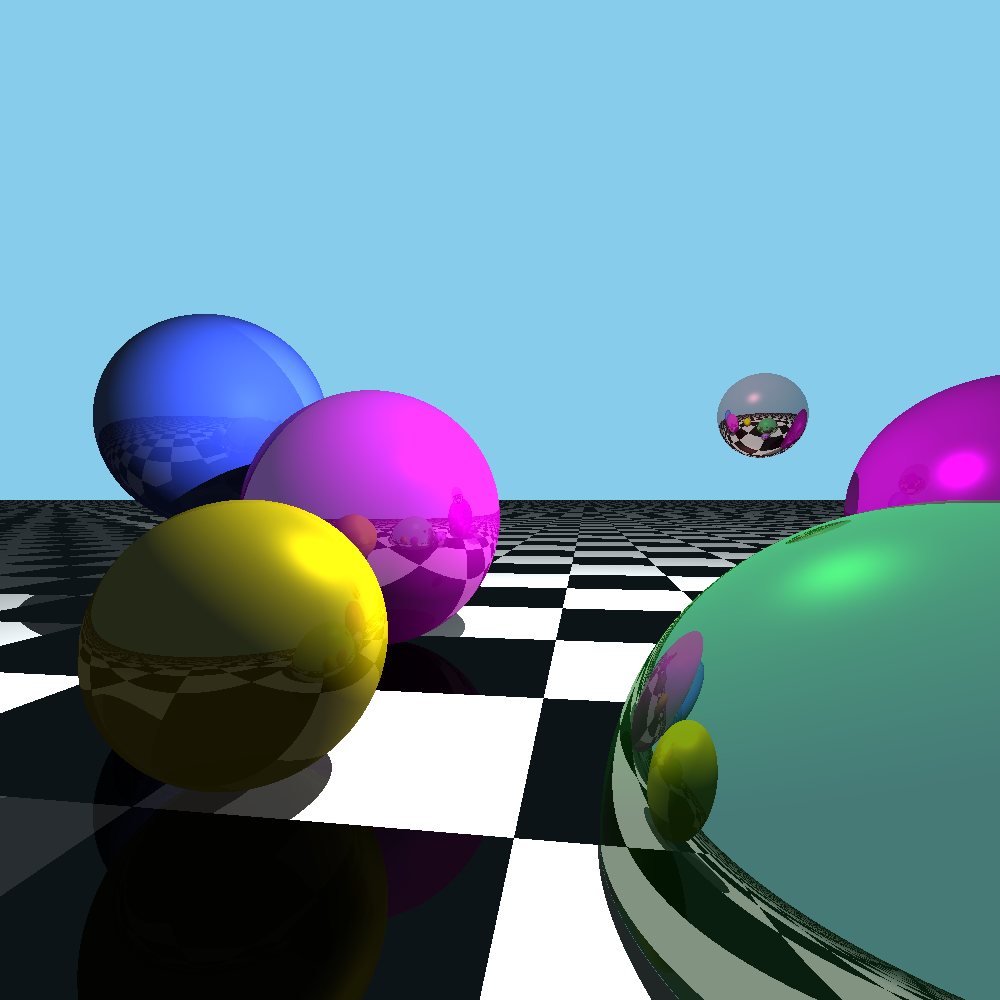
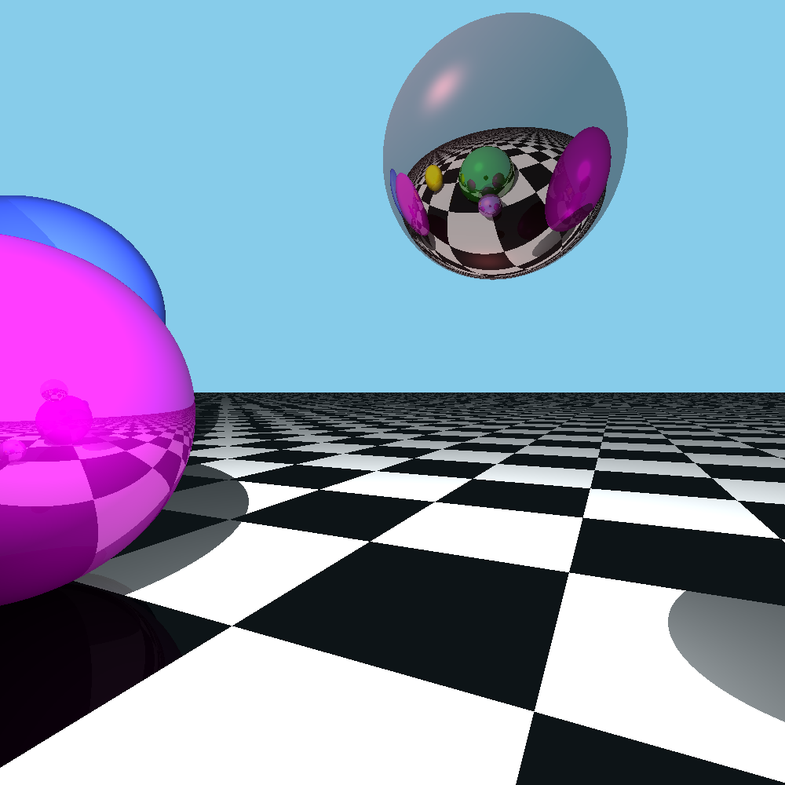

# Ray tracing
This is a simple ray tracing project. The implemented features are
- 3D Shapes (Spheres, triangles, pyramids, and cubes)
- Reflection by ray tracing
- Point light and spotlight
- press `0` to capture

# Results

To make it easier for viewers to understand what this code does, I have generated two gifs by capturing the ray-casted image from the OpenGL window. 

## 5 Spheres
first gif is with 5 spheres scattered in the scene. There are 2 point lights and 1 spotlight.

## 8 spheres
second gif is with 8 spheres scattered in the scene. There are 3 point lights and 2 spotlights
