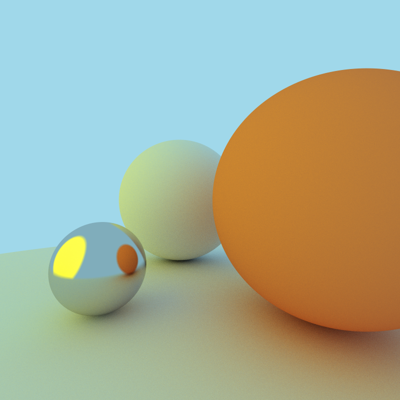
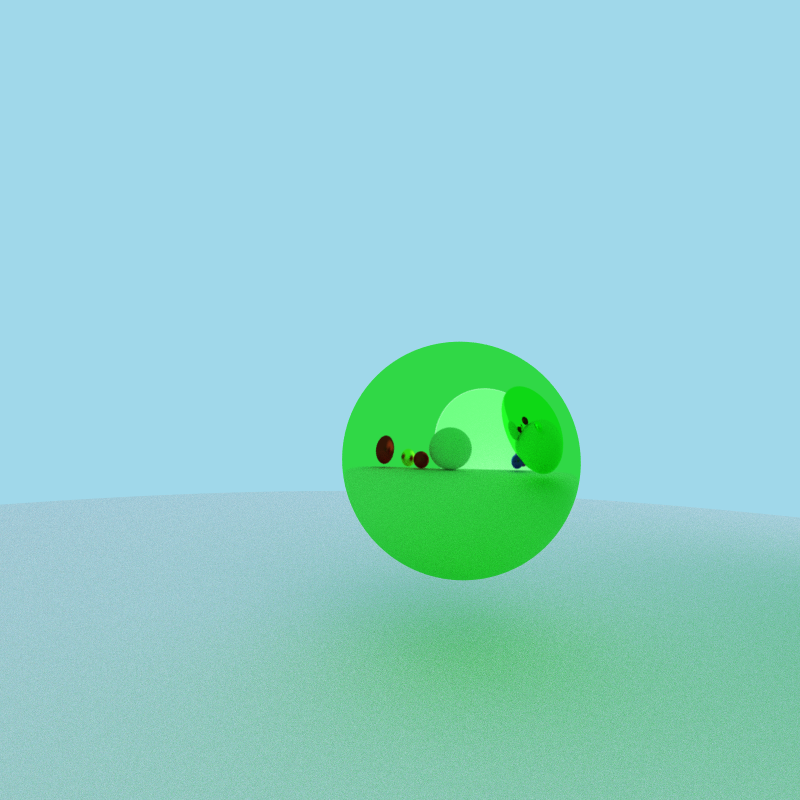

# Ray tracing Redone

- Emissive objects (light sources)
- Anti-aliasing
- Ambient occlusion

## Video demo
Samples per pixel (SPP) has been set as 10, 100, and 1000 for this video
<video src="./code/assets/video/5 spheres transition.mp4" width="600" height="600" controls></video>

For this video, spp has been set to 100, different materials were used for the spheres (lambertian, rough metal and smooth metal respectively)
<video src="./code/assets/video/one sphere.mp4" width="600" height="600" controls></video>